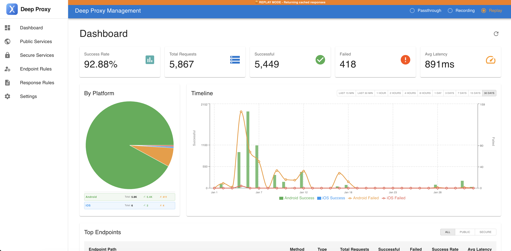
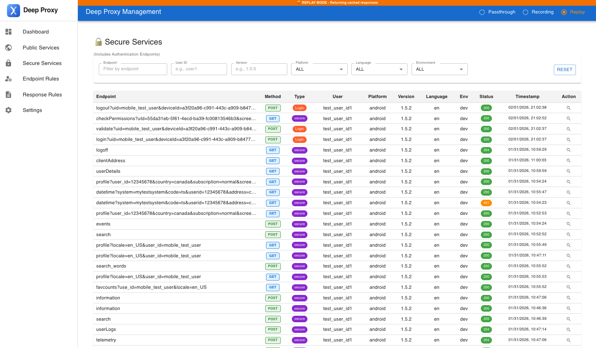
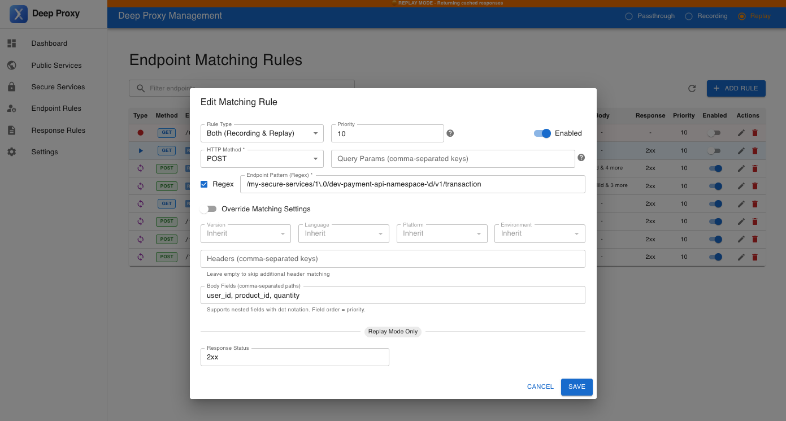
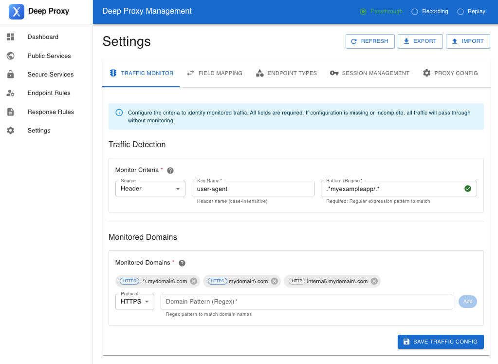
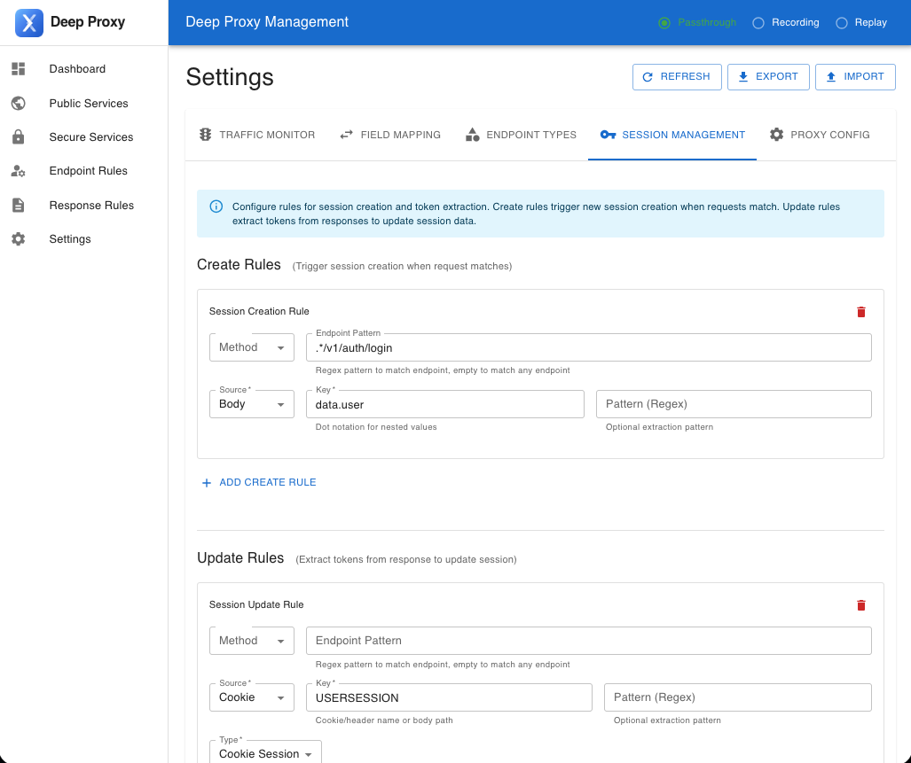
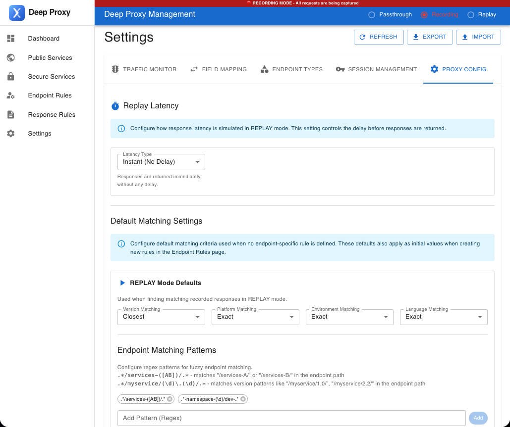

# Deep Proxy - a HTTP Proxy

Deep Proxy is a practical HTTP proxy for mobile app development, testing, and debugging. It helps teams capture real API traffic, replay it with confidence, and keep testing smooth even when backend services are changing or unavailable.

It is built for real-world mobile app workflows: user-specific responses, smarter replay matching, automatic response updates, and a browser-based dashboard that makes the whole experience easier to manage.

The biggest advantage is the Web UI Console. Instead of juggling config files and manual steps, you can manage sessions, review traffic, tune matching rules, and switch modes from one place.

## Why It Stands Out

- **User-aware replay**: Deep Proxy can capture request and response data by user session, so replay mode can return the right response for the right user.
- **Smarter fuzzy matching**: It can match by user ID, app version, platform, environment, language, namespace, and more, so replay feels more natural for the client app.
- **Always current during recording**: When a new response arrives, recording mode can update the latest response automatically, helping your cache stay fresh.
- **Flexible configuration**: Monitoring hosts, authentication, data mapping, and extraction rules are configurable, making it easier to support different backend services.

## Quick Features

- 🔴 **Recording Mode**: Capture real requests and automatically keep the latest response up to date, so the recorded data stays useful instead of going stale.
- ▶️ **Replay Mode**: Serve cached responses instantly, with user-aware and fuzzy matching that helps the app receive a response that fits the current session and context.
- ➡️ **Passthrough Mode**: Forward requests directly when you want to talk to the live backend with no caching in the way.
- **Smart Session Management**: Track user sessions and tokens across requests, so the same user can get consistent responses across the app.
- **Web UI Dashboard**: The key feature of Deep Proxy. Review traffic, manage cache, refine matching rules, and control the proxy from a clean browser-based interface.
- **Database-Driven Config**: Keep the important rules in the app instead of scattered config files, so setup and maintenance stay simple.
- **Security**: Basic protections like API key auth, encryption, and rate limiting help keep proxy usage safer for teams.

## Dashboard



The dashboard gives you a quick visual overview of the proxy experience. It is designed to make everyday actions like checking traffic, managing cache, and switching modes feel simple, fast, and convenient.

## Captured Traffic Inspector



An inspection view for captured requests and responses, showing the full request URL, query parameters, headers, body, response status, response headers, response body, timestamp, and the matching user, app version, platform, and environment context.

## Endpoint Matching Rules



Flexible rules for distinguishing incoming requests by query parameters, request body fields, or header fields so related requests can be grouped by the attributes that matter most.

## Traffic Filtering Settings



Defines which hosts and request keywords Deep Proxy should monitor. All other traffic is passed through directly without being recorded.

## Session Tracking Settings



Configures when a user session should be created and how session information is extracted and updated over time.

## Global Proxy Defaults



Provides the default global configuration for recording and replay mode, so endpoint-specific rules are only needed when a request requires special handling.


## Installation

### Prerequisites

- Node.js >= 18.0.0
- npm >= 9.0.0

### Setup

```bash
# Clone and install
git clone https://github.com/fihtony/DeepProxy.git
cd DeepProxy

# Install dependencies
npm install

# Copy environment configuration
cp .env.example .env

# Initialize database
npm run db:init
```

### Edit Configuration

Open `.env` and set required values:

- `ADMIN_API_KEY` - Admin API authentication
- `ENCRYPTION_KEY` - Data encryption (64 hex chars)
- `JWT_SECRET` - Web UI authentication
- Other settings (PORT, HOST, etc.) have sensible defaults

### Run Deep Proxy

```bash
# Development mode (with auto-reload)
npm run dev

# Production mode
npm start
```

Access the proxy at:

- **Proxy Server**: http://localhost:8080
- **Web UI Dashboard**: http://localhost:3080
- **Admin API**: http://localhost:8080/admin

### Run Web UI

The Web UI is a React application that provides a dashboard for managing the proxy. To run it:

```bash
# From the project root, run the web UI in development mode
npm run web:dev

# Or navigate to the web directory and run directly
cd web
npm install  # First time setup only
npm run dev
```

The Web UI will be available at http://localhost:3080. Make sure the proxy server is running on port 8080 for the Web UI to connect to the backend API.

To build the Web UI for production:

```bash
npm run web:build
```

## Usage


### Switch Modes

**Via Web UI** (Recommended):

1. Navigate to http://localhost:3080
2. Click mode toggle (Recording → Replay → Passthrough)

**Via API**:

```bash
curl -X POST http://localhost:8080/admin/mode \
  -H "Authorization: Bearer <ADMIN_API_KEY>" \
  -d '{"mode": "replay"}'
```

### Typical Workflow

1. **Recording Phase**: Set to `recording` mode
2. **Use Your App**: Perform normal testing with mobile app
3. **Review Cache**: Check Web UI to confirm responses were cached
4. **Switch to Replay**: Set mode to `replay` for offline testing
5. **Test Offline**: App works without backend connection
6. **Use Passthrough**: Route all traffic directly without caching

## Configuration

**Most settings are now database-driven** and managed via the Web UI:

- Traffic monitoring rules for deciding which requests to record and replay
- Field mapping and extraction for capturing useful data from headers, bodies, and responses
- Session creation rules for linking requests to the right user
- Endpoint matching patterns for version, platform, language, environment, and namespace-aware replay

Only essential infrastructure settings are in `.env`:

- Server host and ports
- Database location
- Security keys
- Logging configuration
- Web UI settings

## Directory Structure

```
src/
  ├── modes/               # Recording/Replay/Passthrough implementations
  ├── database/           # SQLite schema and initialization
  ├── config/            # Configuration management
  ├── services/          # Core business logic
  ├── utils/             # Session management, logging, utilities
  └── middleware/        # Authentication, validation, body capture
web/
  └── src/              # React Web UI dashboard
```


## License

Copyright (c) 2026 Tony Xu <tony@tarch.ca>

Licensed under the MIT License. See [LICENSE](LICENSE) file for details.
